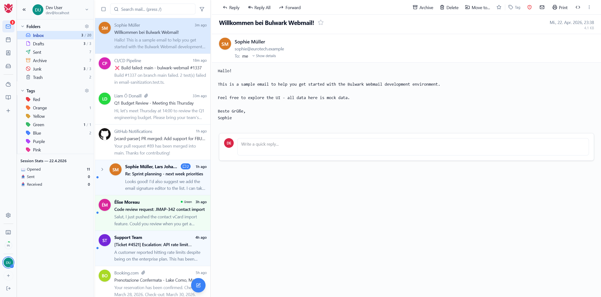
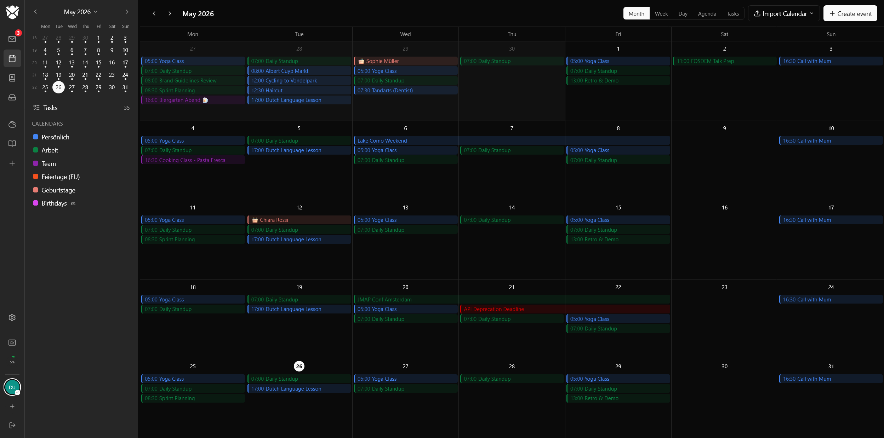
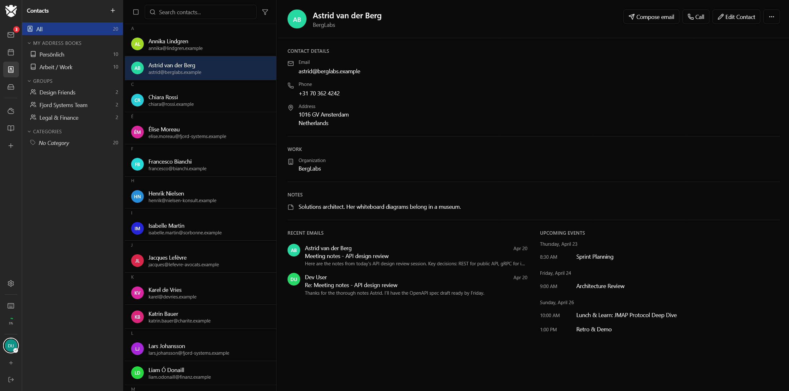
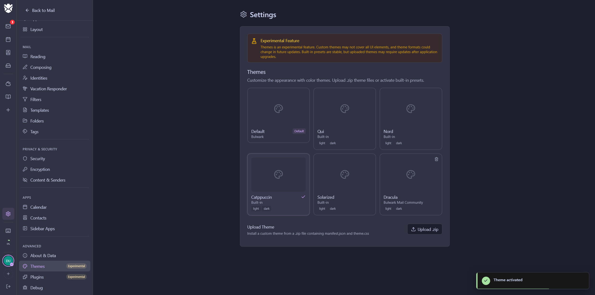
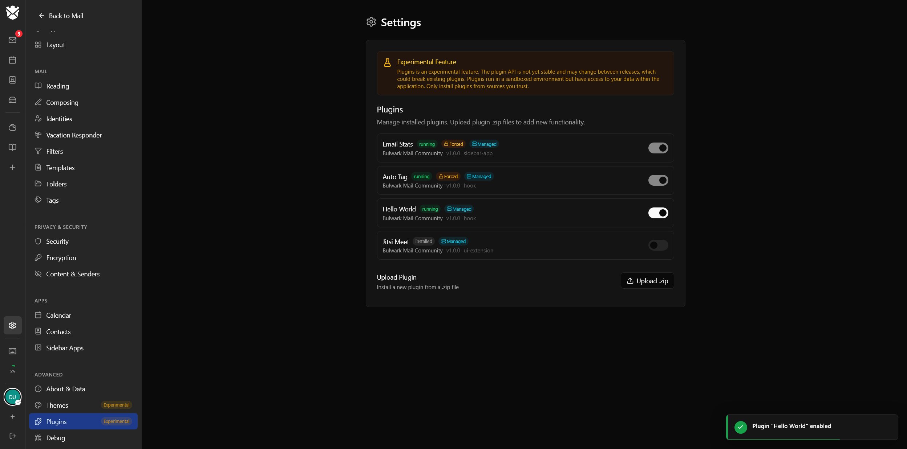
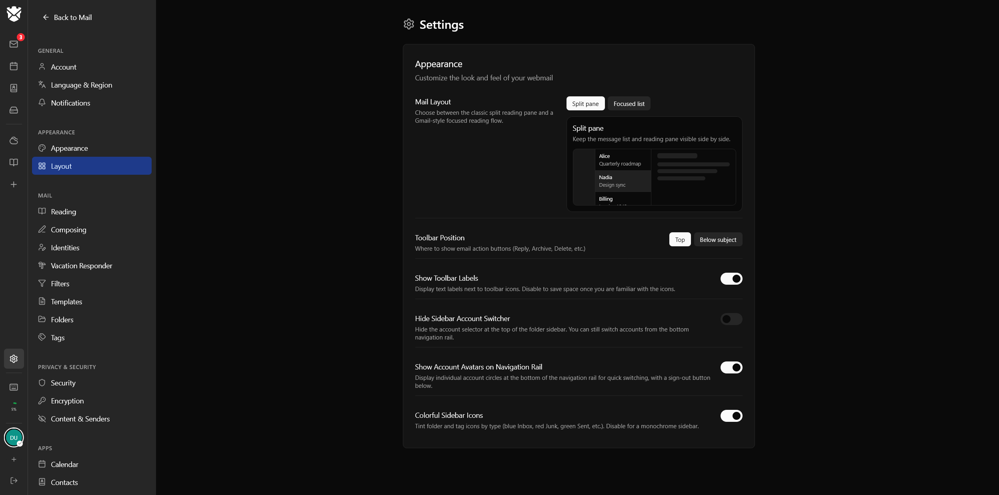

<div align="center">

<picture>
  <source media="(prefers-color-scheme: dark)" srcset="public/branding/Bulwark_Logo_with_Lettering_White_and_Color.svg" />
  <source media="(prefers-color-scheme: light)" srcset="public/branding/Bulwark_Logo_with_Lettering_Dark_Color.svg" />
  
</picture>

# Bulwark Webmail

A self-hosted webmail client for [Stalwart Mail Server](https://stalw.art/), built with Next.js and the JMAP protocol.

[](LICENSE)
[](https://discord.gg/tYCujymGrT)
[](CHANGELOG.md)
[](https://ghcr.io/bulwarkmail/webmail)
</div>

---

## Installer

Since **1.6.4**, a web-based setup wizard runs on first launch – no `.env.local` editing, no shelling into the container.

Point a browser at the running container and the wizard guides you through:

- **Server** – probe one or more JMAP endpoints, optional auto-pick by email domain, Stalwart feature toggle
- **Auth** – OAuth2 / OIDC discovery and validation, or basic-auth fallback
- **Security** – generate or paste a `SESSION_SECRET`, opt into settings sync
- **Logging** – text or JSON, level
- **Branding** – upload favicon, app logos, login logos, and company / legal URLs
- **Review** – grouped summary with an advanced toggle for the full config
- **Admin** – set the initial admin password and optionally drop a `.config-locked` marker so the config volume can be remounted read-only

The wizard writes to `ADMIN_CONFIG_DIR` (`./data/admin` by default). Setting `JMAP_SERVER_URL` in the environment skips the wizard and uses env-managed configuration instead.

---

## Screenshots

<picture>
  <source media="(prefers-color-scheme: dark)" srcset="screenshots/mail-dark.png" />
  
</picture>

<table>
<tr>
<td width="50%"></td>
<td width="50%"></td>
</tr>
<tr>
<td><sub><b>Calendar</b> – month, week, day, and agenda views with drag-to-reschedule, iMIP invitations, and CalDAV subscriptions.</sub></td>
<td><sub><b>Contacts</b> – multiple address books, groups, vCard import/export, and autocomplete in the composer.</sub></td>
</tr>
<tr>
<td></td>
<td></td>
</tr>
<tr>
<td><sub><b>Themes</b> – bundled color themes or upload your own as ZIP bundles; admins can enforce presets.</sub></td>
<td><sub><b>Plugins</b> – extend the client with bundled or third-party plugins installed from a .zip file.</sub></td>
</tr>
<tr>
<td></td>
<td></td>
</tr>
<tr>
<td><sub><b>Light mode</b> – full theme support, remapping HTML email colors by luminance so dark-on-dark text stays readable.</sub></td>
<td><sub><b>Settings</b> – appearance, identities, filters, templates, security, and more.</sub></td>
</tr>
</table>

## What Bulwark includes

Bulwark is a full webmail suite. It bundles the four apps most self-hosters end up wanting:

- **Mail** – threading, unified inbox, cross-account "All accounts" views, full-text search, Sieve filters, S/MIME, templates
- **Calendar** – month/week/day/agenda, recurring events, iMIP invitations, CalDAV subscriptions
- **Contacts** – multiple address books, groups, vCard import/export
- **Files** – Stalwart's JMAP FileNode storage with previews and folder upload

They share one login, one settings store, and one admin dashboard. SSO, 2FA, multi-account, 24 languages, PWA install, themes, and plugins apply across all four.

Full feature list: **[FEATURES.md](FEATURES.md)**.

---

## Quick start

### Docker

```bash
docker run -d -p 3000:3000 ghcr.io/bulwarkmail/webmail:latest
```

Or with Docker Compose:

```bash
docker compose up -d
```

On first launch, open `http://localhost:3000` and the setup wizard takes over. Installs that already define `JMAP_SERVER_URL` skip it and keep the env-managed flow under [Configuration](#configuration).

### From source

```bash
git clone https://github.com/bulwarkmail/webmail.git
cd webmail
npm install
npm run build && npm start
# Then open http://localhost:3000 to run the setup wizard
```

### Development

```bash
cp .env.dev.example .env.local   # Built-in mock JMAP server, no mail server needed

npm run dev                # Dev server
npm run typecheck
npm run lint
npx vitest run             # Unit tests
npm run test:integration   # Dockerized Stalwart + Playwright suite (see integration/README.md)
```

## Configuration

Most deployments are configured through the setup wizard on first launch, then the admin dashboard; those values live in the admin config directory rather than `.env.local`. Environment variables still work, and they suit read-only or immutable infrastructure better. An environment variable always wins over the admin-managed value, so setting `JMAP_SERVER_URL` hides that field from the wizard and locks it in the admin UI.

Nearly all variables are evaluated at runtime, so Docker deployments can be reconfigured without rebuilding. The exceptions are the `NEXT_PUBLIC_*` ones noted below, which Next.js bakes in at build time. Edit `.env.local`:

```env
# Optional – overrides whatever the wizard writes
JMAP_SERVER_URL=https://mail.example.com
APP_NAME=My Webmail
```

<details>
<summary>Server listen address</summary>

```env
HOSTNAME=0.0.0.0    # Default; use "::" for IPv6
PORT=3000
```

</details>

<details>
<summary>OAuth2 / OIDC</summary>

```env
OAUTH_ENABLED=true
OAUTH_ONLY=true                   # hide the username/password form entirely
OAUTH_CLIENT_ID=webmail
OAUTH_CLIENT_SECRET=              # optional, for confidential clients
OAUTH_CLIENT_SECRET_FILE=         # path to a file containing the secret
OAUTH_ISSUER_URL=                 # optional, for external IdPs
OAUTH_AUTHORIZE_URL=              # override only the user-facing authorize endpoint
OAUTH_ALLOW_PRIVATE_ENDPOINTS=    # allow discovery to resolve to RFC-1918 addresses
```

Endpoints are auto-discovered via `.well-known/oauth-authorization-server` or `.well-known/openid-configuration`. `OAUTH_ALLOW_PRIVATE_ENDPOINTS` is off by default as an SSRF guard. Enable it only for split-DNS deployments where the issuer's public hostname resolves to an internal IP.

</details>

<details>
<summary>Anonymous telemetry</summary>

```env
BULWARK_TELEMETRY=on                 # opt-in; off by default
TELEMETRY_DATA_DIR=./data/telemetry  # instance id and consent; mount a volume
```

Off unless you turn it on, in the admin UI, the installer, or here. Heartbeats carry version, platform, bucketed account counts, and feature toggles. No email addresses, hostnames, or IPs. Setting the variable (to either value) locks the choice and disables the admin toggle.

</details>

<details>
<summary>Session & settings sync</summary>

```env
SESSION_SECRET=                      # openssl rand -base64 32
SESSION_SECRET_FILE=/session-secret  # path to a file containing the secret

SETTINGS_SYNC_ENABLED=true
SETTINGS_DATA_DIR=./data/settings    # mount as a volume in Docker
```

Credentials are encrypted with AES-256-GCM and stored in an httpOnly cookie (30-day expiry). Settings sync stores per-account preferences encrypted at rest and requires `SESSION_SECRET`.

</details>

<details>
<summary>Custom JMAP endpoint</summary>

```env
ALLOW_CUSTOM_JMAP_ENDPOINT=true
```

Shows a "JMAP Server" field on the login form. External servers must CORS-allow the webmail origin.

</details>

<details>
<summary>Branding & PWA</summary>

```env
APP_NAME=My Webmail
APP_SHORT_NAME=Webmail
APP_DESCRIPTION=Your personal mail

FAVICON_URL=/branding/favicon.svg
PWA_ICON_URL=/branding/icon.svg      # falls back to FAVICON_URL
PWA_THEME_COLOR=#3b82f6
PWA_BACKGROUND_COLOR=#ffffff

APP_LOGO_LIGHT_URL=/branding/logo-light.svg
APP_LOGO_DARK_URL=/branding/logo-dark.svg
LOGIN_LOGO_LIGHT_URL=/branding/login-light.svg
LOGIN_LOGO_DARK_URL=/branding/login-dark.svg

LOGIN_COMPANY_NAME=My Company
LOGIN_WEBSITE_URL=https://example.com
LOGIN_IMPRINT_URL=https://example.com/imprint
LOGIN_PRIVACY_POLICY_URL=https://example.com/privacy

# Per-domain overrides (optional). When the webmail is served on multiple
# hostnames, each host can override any subset of the branding fields above.
# Match is on the request Host (or X-Forwarded-Host). Use "*.example.com" to
# match any subdomain. Unset fields fall back to the global values.
DOMAIN_BRANDING=[{"host":"maildomain1.com","loginCompanyName":"Company One","loginLogoLightUrl":"/branding/one.svg"},{"host":"maildomain2.com","loginCompanyName":"Company Two"}]
```

</details>

<details>
<summary>Extension directory</summary>

```env
EXTENSION_DIRECTORY_URL=https://extensions.bulwarkmail.org
```

Enables the admin marketplace for browsing and installing plugins and themes.

</details>

<details>
<summary>Stalwart integration & logging</summary>

```env
STALWART_FEATURES=true               # password change, Sieve filters, etc.

LOG_FORMAT=text                      # "text" or "json"
LOG_LEVEL=info                       # error | warn | info | debug
```

</details>

<details>
<summary>Admin data directories</summary>

```env
ADMIN_CONFIG_DIR=./data/admin        # operator-authored: config.json, policy.json, plugins/, themes/
ADMIN_STATE_DIR=./data/admin-state   # runtime: audit log, login timestamps, setup token
ADMIN_CONFIG_READONLY=true           # enforce read-only mode at the app layer
```

The split lets you mount the config volume read-only after the setup wizard completes. Legacy installs that pre-date the split keep working through `ADMIN_DATA_DIR`.

</details>

<details>
<summary>Default UI locale</summary>

The UI language follows each visitor's `Accept-Language` header and their stored preference. `NEXT_PUBLIC_DEFAULT_LOCALE` sets the fallback used when neither matches a supported locale (default `en`):

```env
NEXT_PUBLIC_DEFAULT_LOCALE=de
```

Supported: `ar`, `ca`, `cs`, `da`, `de`, `en`, `es`, `fa`, `fr`, `he`, `hu`, `it`, `ja`, `ko`, `lv`, `nl`, `pl`, `pt`, `ro`, `ru`, `sk`, `tr`, `uk`, `zh`. An unsupported value falls back to `en`.

Like `NEXT_PUBLIC_BASE_PATH`, this is read at **build time**. To use it with the published Docker image, build your own:

```bash
docker build --build-arg NEXT_PUBLIC_DEFAULT_LOCALE=de -t bulwark-webmail .
```

</details>

<details>
<summary>Subpath / reverse proxy mount</summary>

To serve the webmail at a subpath (e.g. `https://example.com/webmail`):

```env
NEXT_PUBLIC_BASE_PATH=/webmail
NEXT_PUBLIC_LOCALE_PREFIX=always     # avoids next-intl rewrite loops
```

Unlike most other variables, `NEXT_PUBLIC_BASE_PATH` is read at **build time** because Next.js bakes it into emitted asset URLs. To use it with the published Docker image, build your own image with the variable set:

```bash
docker build --build-arg NEXT_PUBLIC_BASE_PATH=/webmail -t bulwark-webmail .
```

Then point your reverse proxy at the container without stripping the prefix. The app expects requests under `/webmail/...` and serves every route (`/webmail/api/...`, `/webmail/_next/static/...`, `/webmail/sw.js`, and so on) accordingly.

</details>

## Keyboard shortcuts

| Key                  | Action                  |
| -------------------- | ----------------------- |
| `j` `↓` / `k` `↑`    | Navigate between emails |
| `Enter` / `o`        | Open email              |
| `Esc`                | Close / deselect        |
| `x`                  | Expand / collapse thread |
| `c`                  | Compose                 |
| `r` / `R` `a`        | Reply / Reply all       |
| `f`                  | Forward                 |
| `s`                  | Star                    |
| `e`                  | Archive                 |
| `#` / `Del`          | Delete                  |
| `u` / `Shift`+`I`    | Mark unread / read      |
| `!`                  | Toggle spam             |
| `Ctrl`+`A`           | Select all              |
| `Shift`+`G`          | Refresh                 |
| `/`                  | Search                  |
| `?`                  | Show all shortcuts      |

In the composer: `Ctrl/Cmd`+`Enter` sends, `Ctrl/Cmd`+`Shift`+`Enter` opens scheduled send, and `t` opens the template picker.

## Tech stack

|               |                                                   |
| ------------- | ------------------------------------------------- |
| **Framework** | [Next.js 16](https://nextjs.org/) with App Router, React 19 |
| **Language**  | TypeScript                                        |
| **Styling**   | [Tailwind CSS v4](https://tailwindcss.com/)       |
| **State**     | [Zustand](https://zustand-demo.pmnd.rs/)          |
| **Protocol**  | Custom JMAP client (RFC 8620)                     |
| **Editor**    | [Tiptap](https://tiptap.dev/)                     |
| **i18n**      | [next-intl](https://next-intl-docs.vercel.app/)   |
| **Icons**     | [Lucide React](https://lucide.dev/)               |
| **Testing**   | [Vitest](https://vitest.dev/) + [Playwright](https://playwright.dev/) |

## Why Stalwart?

[Stalwart](https://github.com/stalwartlabs/mail-server) is a Rust mail server with native JMAP support – not IMAP/SMTP with JMAP bolted on. It handles JMAP, IMAP, SMTP, and ManageSieve in a single self-hosted binary with no third-party dependencies.

## Contributing

See [CONTRIBUTING.md](CONTRIBUTING.md).

## License

[GNU AGPL v3](LICENSE). This repository preserves the original MIT attribution for the fork lineage in [NOTICE](NOTICE).

## Acknowledgments

Thanks to [root-fr/jmap-webmail](https://github.com/root-fr/jmap-webmail/) and [@ma2t](https://github.com/ma2t) for the groundwork this project builds upon.
